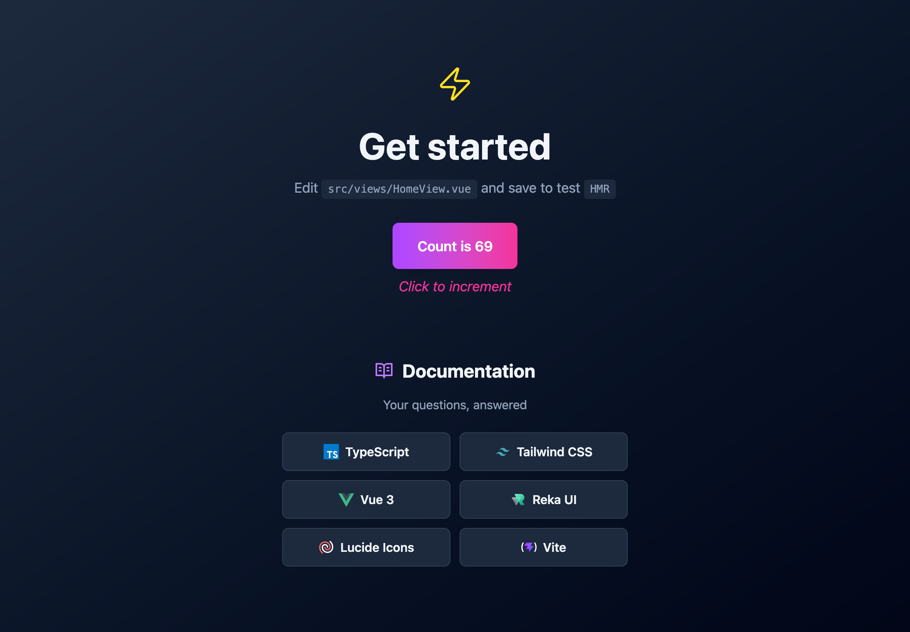

# Vue App Template



A modern, production-ready Vue 3 project template with TypeScript, Vite, TailwindCSS, and a complete development tooling setup.

## 🚀 Tech Stack

### Core Framework

- **Vue 3** - Progressive JavaScript framework for building user interfaces
- **TypeScript** - Type-safe JavaScript development
- **Vite** - Next-generation frontend build tool with lightning-fast HMR

### Styling & UI

- **TailwindCSS v4** - Utility-first CSS framework with `@tailwindcss/postcss` plugin
- **Shadcn Vue** - High-quality, unstyled, and composable Vue components based on Radix UI
- **PostCSS** - CSS transformations with Autoprefixer
- **Lucide Icons** - Beautiful, minimal SVG icons with Vue 3 components
- **CVA (Class Variance Authority)** - Type-safe component style variants
- **clsx & tailwind-merge** - Intelligent class name utilities for conditional and conflicting classes

### Routing

- **Vue Router** - Official router for Vue.js applications

### Code Quality & Formatting

- **ESLint** - JavaScript linter with Vue plugin support
- **Prettier** - Code formatter
- **@typescript-eslint** - TypeScript ESLint support

### Testing

- **Vitest** - Unit testing framework powered by Vite
- **Vue Test Utils** - Component testing utilities for Vue
- **jsdom** - DOM implementation for testing
- **Playwright** - E2E testing framework with multi-browser support

### Quality & CI/CD

- **Husky** - Git hooks to enforce code quality
- **lint-staged** - Run linters on staged files
- **GitHub Actions** - Automated CI/CD pipeline

## 🛠️ Available Scripts

### Development

```bash
npm run dev          # Start development server with HMR
npm run preview      # Preview production build locally
```

### Building

```bash
npm run build        # Full build pipeline: format → lint → type-check → bundle
```

### Code Quality

```bash
npm run check        # Run format and lint checks
npm run format       # Format code with Prettier
npm run lint         # Check code with ESLint
npm run lint:fix     # Auto-fix ESLint violations
```

### Testing

```bash
npm run test         # Run unit tests once with quality checks
npm run test:watch   # Run unit tests in watch mode with quality checks
npm run test:ui      # Interactive unit test UI dashboard
npm run test:e2e     # Run E2E tests with Playwright
npm run test:all     # Run all tests: unit (once) + E2E (quality checks enforced)
```

## ✨ Features

- ✅ **TypeScript Support** - Full type safety across the entire project
- ✅ **Vite HMR** - Instant Hot Module Replacement during development
- ✅ **TailwindCSS v4** - Modern utility-first styling with semantic typography classes
- ✅ **Shadcn Vue Components** - Professional, composable UI components ready to copy into your project
- ✅ **Component Library** - Professional UI components powered by Shadcn Vue
- ✅ **Routing** - Vue Router with lazy-loaded components
- ✅ **Testing** - Vitest with component testing utilities
- ✅ **Code Quality** - ESLint, Prettier, and TypeScript type checking
- ✅ **Icons** - Lucide Icons integration via `lucide-vue-next` Vue components
- ✅ **Semantic Typography** - CSS classes with `@apply` for consistent text styling
- ✅ **Dark Theme** - Production-ready dark mode by default
- ✅ **Pre-commit Quality** - Format and lint run automatically before builds and tests
- ✅ **E2E Testing** - Playwright for comprehensive end-to-end testing
- ✅ **GitHub Actions CI** - Automated testing and build verification
- ✅ **Pre-commit Hooks** - Husky + lint-staged enforce quality before commits

## 🚀 Quick Start

### 1. Set up the project

```bash
# Clone the repo and navigate into it
git clone https://github.com/Xayan/vue-app-template.git && cd vue-app-template

# Install dependencies
npm install
```

### 2. Start Development Server

```bash
npm run dev
```

The app will be available at `http://localhost:5173`

### 3. Build for production

```bash
npm run build
```

The build process automatically:

1. Formats all code with Prettier
2. Lints code with ESLint
3. Type-checks with vue-tsc
4. Bundles with Vite for production

## 🧪 Testing

### Unit Tests

Example test included: `src/views/__tests__/HomeView.spec.ts`

```bash
# Run tests once (use in CI or for quick verification)
npm run test

# Run tests in watch mode (use during development)
npm run test:watch

# View interactive test dashboard
npm run test:ui
```

### E2E Tests

Example E2E test included: `e2e/example.spec.ts`

```bash
# Run E2E tests across all browsers
npm run test:e2e

# First time setup: install browsers
npx playwright install
```

Tests run on Chromium, Firefox, and WebKit in CI and can be run locally with the dev server running.

### Full Test Suite

```bash
# Run all tests: unit (once) + E2E with quality checks
npm run test:all
```

This command enforces the complete pipeline: format → lint → unit tests → E2E tests. Use before deployment or in CI.

## 🎨 Component Library

### Shadcn Vue Components (Recommended)

This project prioritizes the use of **Shadcn Vue** components. They are professional, fully accessible, and highly customizable.

#### ShadButton

Professional button component with multiple variants and sizes:

```html
<ShadButton variant="default" size="default" @click="handleClick"> Click me </ShadButton>
```

**Props:** `variant` (default/destructive/outline/secondary/ghost/link), `size` (default/sm/lg/icon/icon-sm/icon-lg)

---

### Custom Components

Legacy custom components are being phased out in favor of Shadcn Vue. Use standard HTML elements or Shadcn components for new features.

## 📦 Adding More Shadcn Vue Components

Shadcn Vue components are copied into your project (not installed as npm packages). To add more components:

```bash
npx shadcn-vue@latest add button      # Already included
npx shadcn-vue@latest add dialog
npx shadcn-vue@latest add dropdown-menu
npx shadcn-vue@latest add card
# ... etc
```

New components will be created in `src/components/ui/[component-name]/`.

**Note:** Each component is a source file that you own and can customize. You're not locked into the original implementation.

## 🔧 Config Files

- `vite.config.ts` - Vite configuration with `@/` path alias
- `vitest.config.ts` - Vitest configuration
- `tsconfig.json` - Root TypeScript configuration (references app and node configs)
- `tsconfig.app.json` - Vue app TypeScript configuration with path aliases
- `tailwind.config.js` - TailwindCSS configuration
- `postcss.config.js` - PostCSS configuration
- `eslint.config.js` - ESLint configuration
- `components.json` - Shadcn Vue configuration for component installation
- `.prettierrc`, `.prettierignore` - Prettier configuration

---

- `opencode.json` - OpenCode configuration for MCP integration
- `AGENTS.md` - Documentation for agents and project structure

## 📚 Read Also

### Documentation

- [State Management](docs/STATE_MANAGEMENT.md)

### External Resources

- [Vue 3 Documentation](https://vuejs.org/)
- [Vue Router Guide](https://router.vuejs.org/)
- [Vite Documentation](https://vitejs.dev/)
- [TailwindCSS v4 Documentation](https://tailwindcss.com/)
- [Shadcn Vue Components](https://ui.shadcn-vue.com/)
- [Lucide Icons](https://lucide.dev/)
- [Vitest Documentation](https://vitest.dev/)

## 📄 License

MIT
